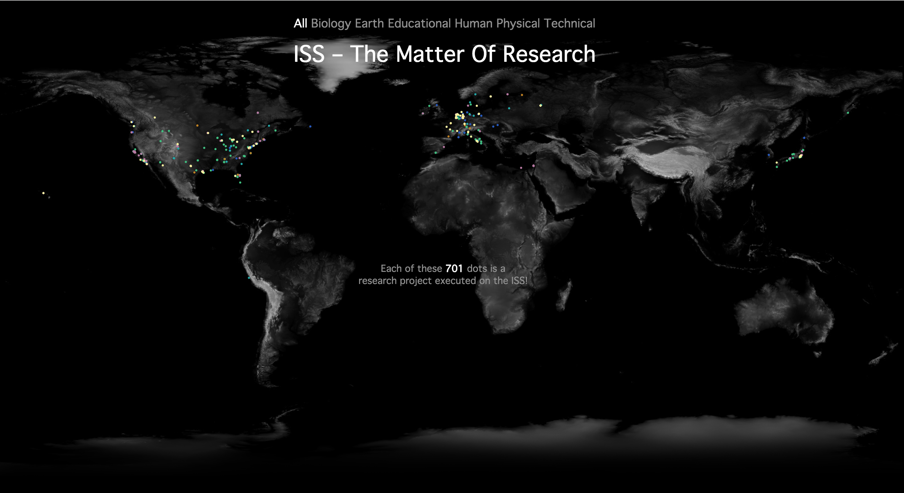

#Steel-Ant, Input/Output, Data Vis

-

###research matters

---

######About
In this project I am showing how many different research projects have been executed on the ISS.
 
 
######first idea
At first I had the idea to make kind of an Interactive-Browser-App.  
I wanted to integrate some different by the NASA provided information. The idea was to give the feeling of nearness and real communication. I decided to give a menu for choosing to get information about the astronauts, live broadcast from the ISS and the newest tweet. Moreover I wanted to show the current research topics, their universities and the current position of the ISS...    

  

definetely too much...

-

######second plan
I just played a little with the data.  

  
I decided to take only the research data and visualize the differences in topic, time and their different investigators.  

But I had a lot trouble getting the data...  
g.e. with [import.io](https://import.io/)  
 

So I changed the strategy and tried [HTTrack](http://www.httrack.com/html/abuse.html), a gorgeous tool for copying websites. To get the desired data, I had to filter the html with another genius tool, called [pup](https://github.com/EricChiang/pup). I precticed [Regex](http://regexr.com/) in my Text-Editor for deleting some in my case useless rubish, but all that did not work well, because of unfortunately, improbable circumstances. Pup is a nice tool, but you need tags in your html. Unfortunately exactly my desired information wasn't in a tag...
But our mentor Fabian Morón Zirfas suggested another tool called [pcregrep](http://www.pcre.org/original/doc/html/pcregrep.html). Together we wrote a ShellScript which filters the html files by the investigators and gives it to a geocoder...
In the end it worked.

-

######my data visualization

[This](http://logetcrea.github.io/research-matters/index.html) is my visualization 'til now.
But I still want to refine it. I need a hover for each project, a link...

-

###### License

**©** 2015 Paul Klinski "logetcrea", University of Applied Sciences Potsdam (Germany).  
Grant of Copyright License. Subject to the terms and conditions of
      this License, each Contributor hereby grants to You a perpetual,
      worldwide, non-exclusive, no-charge, royalty-free, irrevocable
      copyright license to reproduce, prepare Derivative Works of,
      publicly display, publicly perform, sublicense, and distribute the
      Work and such Derivative Works in Source or Object form.

see also [Apache License](http://choosealicense.com/licenses/apache-2.0/)
